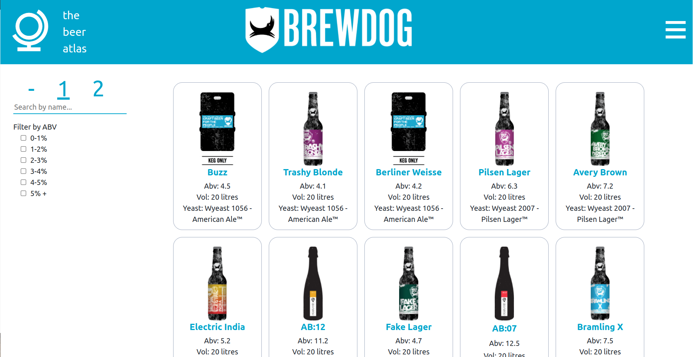

# BEER UI APP

This is a beer UI app using the **[Punk Api](https://punkapi.com/documentation/v2)**
It was created with the help of the create-react-app framework 

## Features

The App has the following features:
- Displays the details of the beer on a card
- Expands the details if you click on the card
- Search functionality
- Filter by Alcohol Percentage

## Running Locally

Open your terminal after clnging the repo and enter `npm install` (you willl need node) once installation is complete you may use `npm start` to begin the app. It should automatically open a new tab and run on `http://localhost:3000/`

